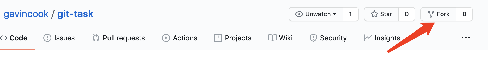
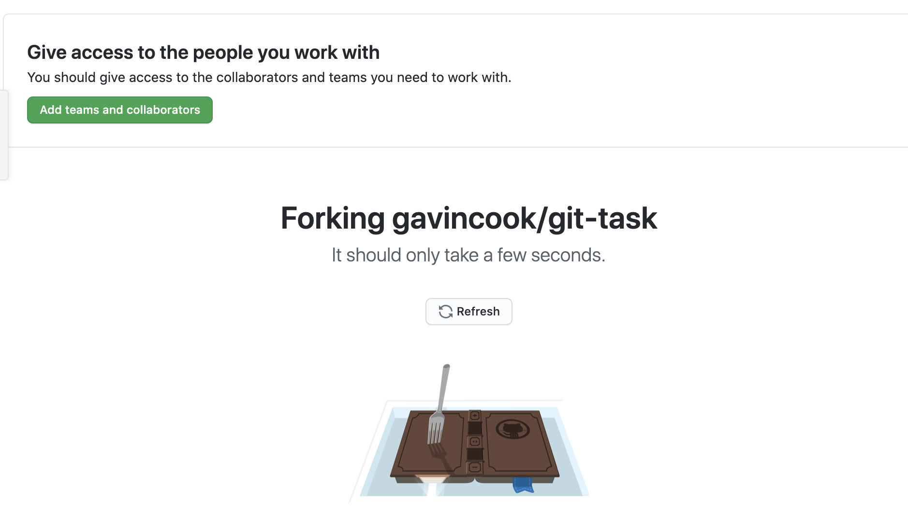
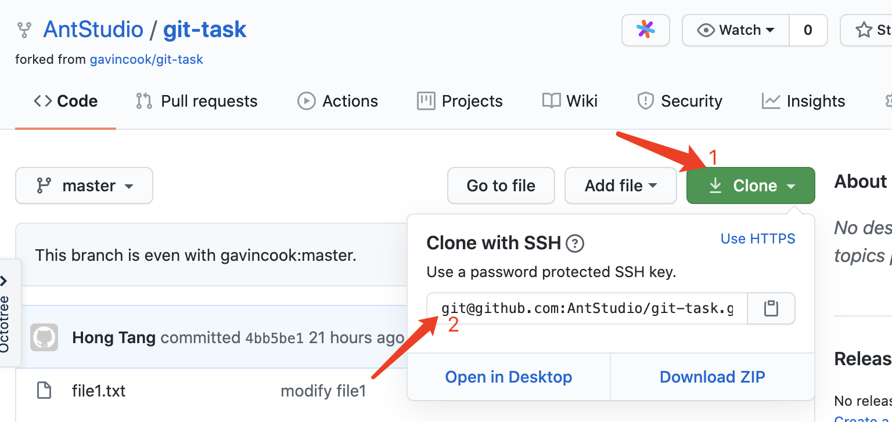

### 1. 注册[github](https://github.com/)账号，并登录
### 2. fork仓库到自己的账号
   打开[作业仓库](https://github.com/gavincook/git-task)，点击右上角的Fork按钮：
   
   然后在弹出框点击自己的账号，然后就会跳转到如下等待界面：
   
   这时就已经完成fork了，只需在这个页面的等待几秒钟就会跳转到fork好的仓库地址。**把当前这个网页的地址复制下来，这个就是最终提交作业需要的地址**
### 3. 克隆自己账号下的项目到本地
   
   在第二步最后的网页中，点击右上方的Clone按钮，弹出框的地址即为仓库地址。使用`git clone`即可完成复制。

### 4. 八仙过海各显神通，发挥你们的聪明才智，将分支提交处理成如下效果
```
* c6c4d02 (HEAD -> master) add file6
*   1be467c Merge branch 'branch_one' into master
|\
| * f632b5f (branch_one) modify file1 on branch_one
* | 4ee0b3b (master) add readme
* | 35ee627 (origin/master) modify file1
* | 9969ef2 append a sentence in file3
|/
* e312900 init
```
对于如上的分支树，可使用`git log --graph --pretty=oneline --abbrev-commit`进行查看。

**提示**
1. 需要将分支`branch_one`中的提交`add file5`回滚掉
2. 需要将分支`branch_one`合并到`master`中
3. 合并时会有冲突，需要保证最后file1.txt的内容如下：
    ```
    If we can only encounter each other rather than stay with each other,then I wish we had never encountered.
    I would like weeping with the smile rather than repenting with the cry,when my heart is broken ,is it needed to fix?
    men love from overlooking while women love from looking up. if love isa mountain, then if men go up, more women they will see while womenwill see fewer men.
    No one indebted for others,while many people don't know how to cherish others.
    honestly, if you're not willing to sound stupid, you don't deserve to be in love.
    ```
4. 合并之后，需要增加一个file6.txt文件，文件内容为：`Done`，并将该文件提交到仓库。

5. 最后仓库的文件如下：
   ```
    README.md 
    file1.txt 
    file2.txt 
    file3.txt 
    file4.txt 
    file6.txt 
    images/
     |- step_1.png
     |- step_2.png
     |- step_.png
   ```
   没有file5.txt喔。
6. 可能会用到的命令：
   * git add
   * git commit
   * git revert 
   * git merge
   * git checkout
   * 等等
**说明**
最后提交的仓库代码，只需要分支结构上述分支树一致和最后的文件内容符合要求即可，无需保证描述前的sha一致，比如分支树中的提交`c6c4d02 (HEAD -> master) add file6`，其中`c6c4d02`就是sha，为git自动生成，使用自己实际的即可。

### 5. 将本地处理好的分支推送到自己的fork仓库中。
提示：使用`git push`命令...

### 6.. 快了，快了，作业就快做完了，将fork仓库的地址贴到金数据中，写上自己的名字，提交！！！

### 参考资料
[搭建Github环境](https://blog.csdn.net/gavincook/article/details/11992827)
